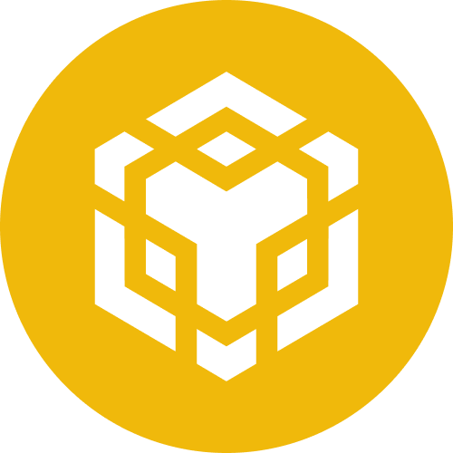

### Convert ERC20 tokens to and from IBC  

EVM Account: Not Connected

Cosmos Account: Not Connected

<ul class="nav nav-tabs nav-justified pt-2" id="myTab" role="tablist">
  <li class="nav-item" role="presentation">
    <button class="nav-link active" id="conversion-tab" data-bs-toggle="tab" data-bs-target="#conversion" type="button" role="tab" aria-controls="home" aria-selected="true">Conversion</button>
  </li>
  <li class="nav-item" role="presentation">
    <button class="nav-link" id="erc20-tab" data-bs-toggle="tab" data-bs-target="#erc20" type="button" role="tab" aria-controls="profile" aria-selected="false">ERC20</button>
  </li>
  <li class="nav-item" role="presentation">
    <button class="nav-link" id="ibc-tab" data-bs-toggle="tab" data-bs-target="#ibc" type="button" role="tab" aria-controls="contact" aria-selected="false">IBC</button>
  </li>
</ul>

  

    <table class="table table-responsive" id="convert-table">
      <thead>
        <tr>
          <th scope="col">ERC20</th>
          <th scope="col">ERC20 Balance</th>
          <th scope="col">IBC</th>
          <th scope="col">IBC Balance</th>
        </tr>
      </thead>
      <tbody></tbody>
    </table>
  

  

    <table class="table table-responsive" id="erc20-table">
      <thead>
        <tr>
          <th scope="col">Name</th>
          <th scope="col">ERC20</th>
          <th scope="col">ERC20 Balance</th>
          <th scope="col">Actions</th>
        </tr>
      </thead>
      <tbody></tbody>
    </table>
  

  

    <table class="table table-responsive" id="ibc-table">
      <thead>
        <tr>
          <th scope="col">Base Denom</th>
          <th scope="col">Denom</th>
          <th scope="col">Balance</th>
          <th scope="col">Actions</th>
        </tr>
      </thead>
      <tbody></tbody>
    </table>
 

### Transfer tokens and NFTs across chains wrapped by Deltaswap with ease.  

  
Read the [docs](https://docs.planq.network/for-users/bridge).  
  
If you want to integrate your chain, join our [Telegram Group](https://t.me/planqnetwork).  

